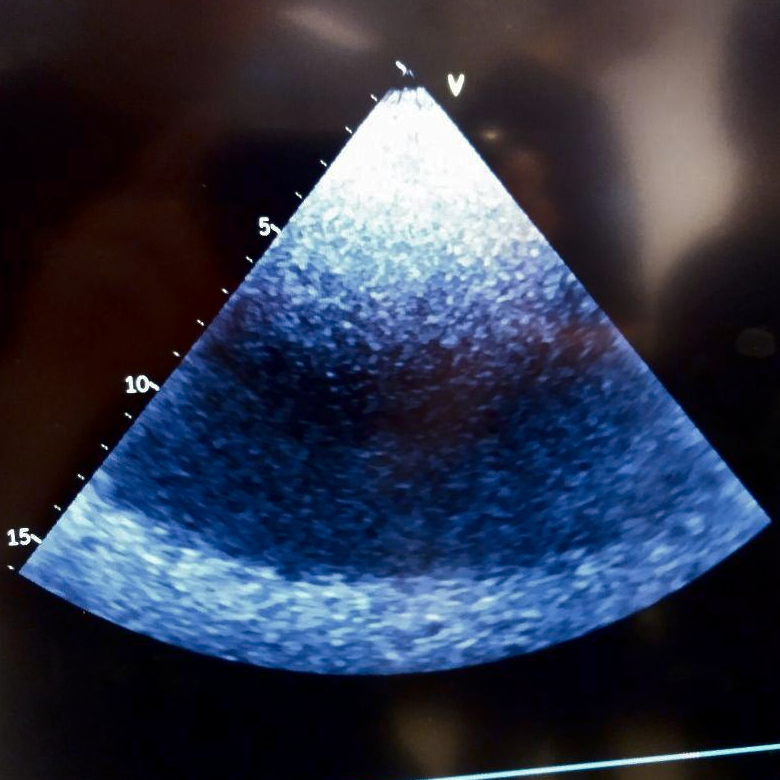
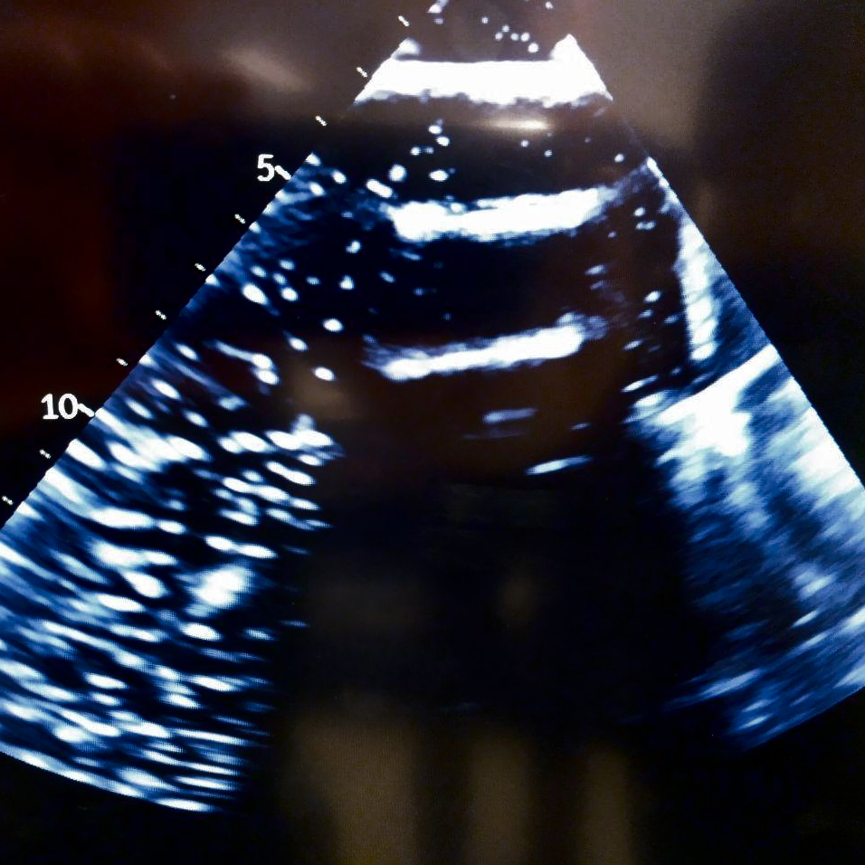

# Exercise 2 - Use of ultrasound scanner

### Problem 1. Images of the body.

#### Try imaging with and without gel on the probe. What is the difference? Why do we put gel on the probe?
> Without the gel, the image quality is very bad because of big impedance differences from the probe over the air gap to the skin. The gel is used to bridge the air gap, i.e. it's used to match the impedance of the probe head to the skin.

#### What are the advantages and disadvantages of ultrasound compared to other images techniques (e.g. X-ray, CT, MRI)?

Advantages:

> * No harmful X-rays or magnetic (gradient) fields that can interfere with ferromagnetic objects
> * Live imaging technique: allows the physician to fiddle around with the probe, injuries that show up in a specific pose of the limbs can be visualized
> * High frame rate, short examination time
> * Can be used during an operation (No X-ray shielding needed for the staff(X-ray, CT), No non-magnetic instruments needed (MRI))
> * Portable
> * Cheap and easy to use
> * No narrow tubes (relevant for patients with claustrophobia)

Disadvantages:

> * In general a lower resolution
> * Lower soft tissue contrast than MRI
> * Areas behind bones and air filled compartments (lungs) cannot be visualized
> * Physical contact to body needed

#### What probe is preferred for a) heart imaging and b) carotid imaging. Why?

> a) The more square one, because it has to fit between the ribs. A phased array with a lower frequency is used, because the heart is located deep in the rib cage.
>
> b) The longer one. It uses a linear array with a higher frequency, because the carotid arteries are locate at the surface of the body.

#### What is the function of the LED on the probe?

> The LED serves to purposes:
>
> * The Probe consists of two US-heads. The LED shows which of them is active.
> * The side on which the LED lights up, shows the user the image orientation on the screen (LED location corresponds to the right side of the screen).

### Problem 2. Obstacles, reverberations and mirroring.

#### Which anatomical obstacles are emulated by the sponge and the wooden plate?

> * Sponge: Large count of trapped air bubbles. Approximates the lung (low impedance)
> * Wooden board: Approximates bones (high impedance)

#### Explain in words what effects these obstacles have on the ultrasound image.

> Sponge: Air bubbles act as scatter centers. Because there are a huge number of those bubbles, all the ultrasound power is scattered away and none penetrates the sponge.
>
> Wooden board: The surface reflects the ultrasound waves

#### Can you explain why the impacts of the sponge and the wooden plate are different.

> Their surface finishes and internal structures are different. While on the wooden board, the surface is relatively flat and allows for specular reflections (according the Snell's law), the rough texture and internals of the polyurethane/air mixture only allows diffuse reflections and scattering.

#### What do you see? Can you explain why?

> Sponge: Mostly white scattering, no signal from behind the sponge, because the US waves don't reach that far through the sponge.

> Wooden board: Multiple reflections between the wood surface and the US probe.

#### Tilt the plate such that the angle between the surface and the plate is approximately 45 degrees. Try to touch the plate with your finger such that the finger shows up on the ultrasound image. What do you see? Can you explain?

> The finger shows up to the side and under the wooden board. Thats because the US probe picks up the finger directly and the reflection of the finger. Since the machine doesn't account for reflections, it assumes the origin of the signal to be under the wooden plate and draws it there.

### Problem 3. Stationary phantom.

####  Adjust the tgc sliders? What happens? Leave the tgc sliders such that all scatterers have about the same intensity.

> The gain for each delay time interval is set, i.e. the gain for each depth range is set. This allows the user to choose different image intensity for different depths.

#### Increase the imaging depth and gain until you can see thermal (flickering) noise in the image. Is the thermal noise stronger far away from or close to the probe? Why?
> The noise in the image is higher in regions with higher depth. In that regions, more gain is used, which decreases the signal to noise ratio.

#### Describe what happens when you change the frequency? Specifically, what happens to resolution and signal intensity versus depth?
> Increasing the frequency increases the resolution, but reduces the penetrating depth.

#### What happens when you change the focus depth?

> Changing the focus depth moves the focal point of the beam formed US ray. That allows the user to choose the plane in the z-Axis with the best resolution